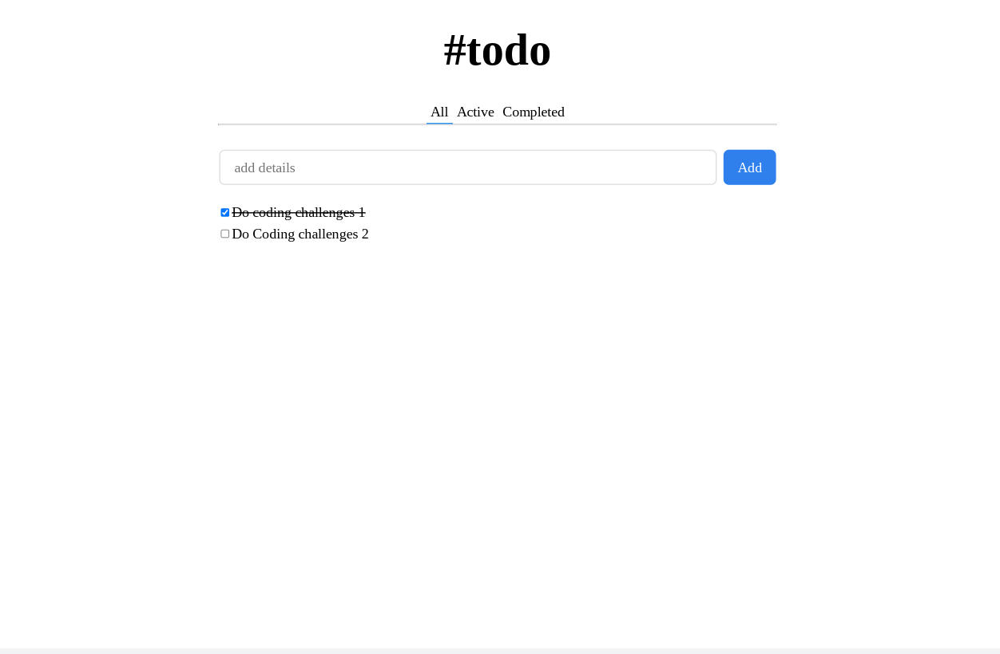
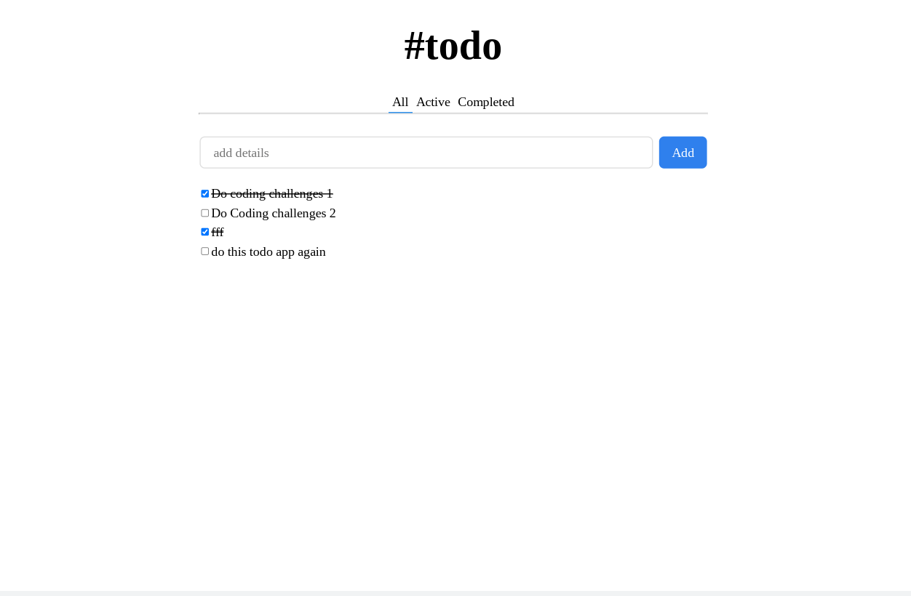
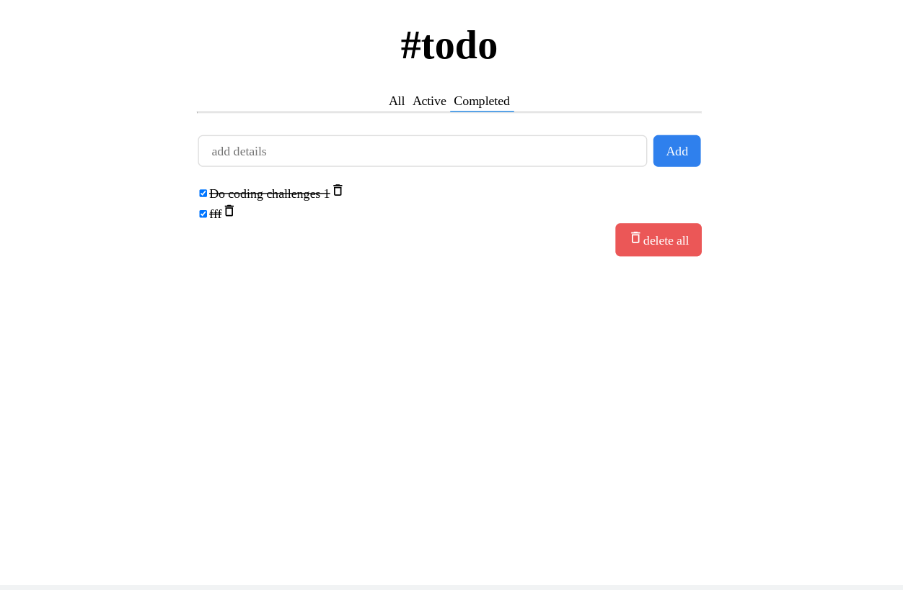

<h1 align="center">Todo Challenge</h1>

   Solution for a challenge from  <a href="http://devchallenges.io" target="_blank">Devchallenges.io</a>.

  <h3>
    <a href="https://jdegand.github.io/todo-challenge">
      Live Link
    </a>
     | 
    <a href="https://devchallenges.io/challenges/hH6PbOHBdPm6otzw2De5">
      Challenge
    </a>
  </h3>

## Table of Contents

- [Overview](#overview)
  - [Built With](#built-with)
- [Features](#features)
- [Thoughts](#thoughts)
- [Useful Resources](#useful-resources)

## Overview

 

 

 

### Built With

- [React](https://reactjs.org/)
- [Material Design Icons](https://materialdesignicons.com/)

## Features

This application/site was created as a submission to a [DevChallenges](https://devchallenges.io/challenges) challenge. The [challenge](https://devchallenges.io/challenges/hH6PbOHBdPm6otzw2De5) was to build an application to complete the given user stories.

## Thoughts 

- useId cannot be used inside a callback.  
- debatable if switch statement used here needs a default case
- using innerText to get the value of the filter is not preferable to using a name property on each button  
- Checkbox functionality & filtering causes many headaches.  Simple solution is to limit checking only when on 'all' filter. 
- Don't want to remove checkboxes or disable them. 
- working around blocked local storage is not easy
- focusing the all filter prevents focusing of the input field. 
- I am working on improving my testing skills.  I had a few issues with testing the submit event.  It can't be directly mocked ([Stack Overflow](https://stackoverflow.com/questions/66110028/how-to-test-button-that-call-submit-form-using-jest-and-react-testing-library)) so you have to test the result of the submit event (is it in the document etc).
- Testing when something is conditionally rendered is something I need to look into.
- Testing is made easier by setting initial todos to be two todos (one completed and one active) versus having both active like devchallenges screenshot
- It probably would have made writing tests easier if app was broken up into smaller components.  
- Could convert checkboxes into accessible style buttons like I have done before
- Local Storage implementation is commented out although it works.  

## Useful Resources

- [Steps to replicate a design with only HTML and CSS](https://devchallenges-blogs.web.app/how-to-replicate-design/)
- [Css Reset](https://piccalil.li/blog/a-modern-css-reset/) - use this css reset as starting point almost every project
- [Stack Overflow](https://stackoverflow.com/questions/59269676/change-the-value-of-object-in-an-array-on-click-event) - change value of object in array onClick
- [Stack Overflow](https://stackoverflow.com/questions/66836514/how-to-change-values-in-array-of-objects-with-an-onclick) - change value of object in array onClick
- [Stack Overflow](https://stackoverflow.com/questions/35206125/how-can-i-find-and-update-values-in-an-array-of-objects/61304412#61304412) - update objects inside arrays
- [Blog](https://bobbyhadz.com/blog/javascript-update-property-of-object-in-array) - update properties of objects in arrays
- [React Docs](https://beta.reactjs.org/learn/updating-arrays-in-state) - updating arrays in state
- [Blog](https://felixgerschau.com/react-localstorage/) - local storage
- [Blog](https://felixgerschau.com/unit-testing-react-introduction/) - unit testing react
- [Stack Overflow](https://stackoverflow.com/questions/4689856/how-to-change-value-of-object-which-is-inside-an-array-using-javascript-or-jquer) - is map really the best way to update an object in an array?
- [Stack Overflow](https://stackoverflow.com/questions/59653951/how-do-i-output-the-filtered-todo-list-in-react-typescript) - filtered todolist
- [YouTube](https://www.youtube.com/watch?v=f39VThCJJZ8) - filtering todos
- [Stack Overflow](https://stackoverflow.com/questions/4649423/should-switch-statements-always-contain-a-default-clause) - switch always need a default case
- [Blog](https://blog.maisie.ink/react-ref-autofocus/) - autoFocus
- [Stack Overflow](https://stackoverflow.com/questions/60688411/assign-local-storage-to-react-state-react-hooks) - local storage & hooks
- [Go Make Things](https://gomakethings.com/how-to-update-localstorage-with-vanilla-javascript/) - update local storage vanilla js
- [Github](https://github.com/thapatechnical/reacttodo) - todo I looked at that gave me some ideas to fix my local storage problems
- [Blog](https://amourycodes.com/guides/a-simple-guide-to-getting-started-with-testing-your-react-components/71d7043798df4b9187730676ca6c4103) - testing react components
- [React Testing Library](https://testing-library.com/docs/queries/about/#queries) - queries
- [Stack Overflow](https://stackoverflow.com/questions/66110028/how-to-test-button-that-call-submit-form-using-jest-and-react-testing-library) - test submit with jest and rtl
- [Stack Overflow](https://stackoverflow.com/questions/55177928/how-do-you-check-a-checkbox-in-react-testing-library) - checkbox testing rtl
- [YouTube](https://www.youtube.com/watch?v=J5kGK2hn7Hw) - checkbox test scenarios
- [Clue Mediator](https://www.cluemediator.com/check-a-checkbox-using-react-testing-library#watc) - testing a checkbox
- [Stack Overflow](https://stackoverflow.com/questions/58623666/how-to-test-if-a-component-is-rendered-with-the-right-props-when-using-react-tes) - testing props
